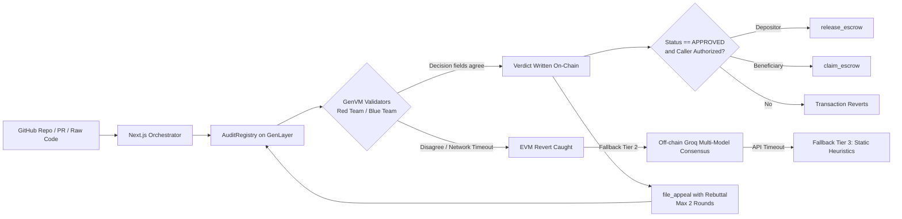

# ConsensusAudit

**A deployment gatekeeper: GenLayer validators independently audit contract code and reach consensus on APPROVED/REJECTED. A verdict reached on-chain can gate GEN escrow in the contract. If on-chain consensus fails, the app falls back to a clearly labeled off-chain check (Groq multi-model, then static heuristics) that never moves real funds.**

Track: **Onchain Justice** · Network: **GenLayer Studio Dev (Chain `61997`)**

Contract: [`0x4E50b22a93F1359eb663170fC334810487f7eEC7`](https://explorer-studio-dev.genlayer.com/address/0x4E50b22a93F1359eb663170fC334810487f7eEC7)

Live Demo: `https://consensusaudit.vercel.app/`

---

## The Problem

Agent-to-agent commerce keeps hitting the same wall: money is owed for a deliverable, and the two parties can't agree whether the deliverable is acceptable.

For smart contracts, "acceptable" has a sharp, objective meaning: it is either exploitable or it isn't. But today, that call is made by one centralized auditor, or one single LLM endpoint, and the paying party has to trust whoever made it. A verdict you can't verify isn't a basis for releasing funds.

ConsensusAudit turns that call into a decentralized consensus, and makes that consensus the literal on-chain trigger that moves real value.

## How it Works



A submission runs inside a non-deterministic GenVM block. The leader performs a red-team / blue-team analysis of the payload; every validator performs its own independently and votes. They must absolutely agree on the **decision fields** (status, and whether any critical or high finding exists) before the verdict is written to state.

The verdict lands in contract storage under an immutable ID. Escrow release is gated entirely by the contract, not the UI: `release_escrow` and `claim_escrow` transfer real `GEN` but will instantly revert unless the stored verdict reads `APPROVED` **and** the caller is the recorded depositor or beneficiary.

## Why this needs GenLayer

This architecture relies on three properties that a normal blockchain or a normal API simply cannot provide:

1. **The judgment is the consensus.** Validators independently reach the verdict. There is no oracle to trust, and no single LLM whose answer you take on faith.
2. **The judgment and the settlement live in the same contract.** The verdict isn't posted to a chain after the fact. The same non-deterministic execution that produced the audit is what the escrow gate reads.
3. **Subjective input, deterministic gate.** "Is this reentrant?" needs a language model. "Does a critical finding block release?" must not. The contract splits them: the LLM proposes counts and findings, and our python `_normalize()` function strictly decides the final status.

## Engineering & Design Highlights

**The 3-Tier Fault-Tolerant Architecture**

Decentralized testnets can occasionally struggle to reach exact JSON-matching consensus on complex LLM outputs. ConsensusAudit features zero-downtime degradation:

1. **GenLayer Consensus:** Primary on-chain execution.
2. **Groq Multi-Model Consensus:** If the EVM reverts, the server catches it and routes the payload to multiple parallel LLMs (e.g., `gpt-oss-120b`, `gpt-oss-20b`). The server resolves the consensus and signs it via HMAC.
3. **Static Heuristics:** If APIs fail, a fallback engine scans for known regex patterns (Reentrancy, `tx.origin`, unsafe `delegatecall`).

**JSON Serialization Storage Bypass**

To support dynamic mapping structures while adhering to GenVM's strict primitive storage compiler, the entire contract state (`verdicts`, `escrows`, `submission_ids`) dynamically serializes and deserializes from `str`. This guarantees bulletproof state indexing without compiler errors.

**Native Custody & Beneficiary Claims**

`open_escrow` is a `@gl.public.write.payable` method that locks real `GEN` directly from `gl.message.value`. Furthermore, the beneficiary can call `claim_escrow` to pull funds themselves once the verdict is `APPROVED`, natively closing the "depositor refuses to release" attack vector.

**Intelligent Repository Ingestion**

Instead of blindly sending a GitHub repo to the LLM, the Next.js orchestrator uses a custom scoring algorithm to pull the most critical files (prioritizing `.sol` / `core` / `contract` over `test` / `mock`), packing the context window efficiently before sending it to GenLayer.

**Validator Telemetry & Certificate Export**

The UI features live node simulation states and allows users to export a finalized Markdown security certificate containing the execution latency, vulnerability counts, and the cryptographic hash/transaction link of the consensus.

## What's on Chain

| State | Meaning |
| --- | --- |
| `verdicts[submission_id]` | status, critical/high counts, findings, submitter, appeal depth, previous id |
| `escrows[submission_id]` | status, amount, depositor, beneficiary |

**Audit Methods:** `submit_audit`, `file_appeal`, `get_verdict`, `list_submissions`

**Escrow Methods:** `open_escrow` *(payable)*, `release_escrow`, `claim_escrow`, `refund_escrow`, `get_escrow`

**Admin Methods:** `set_paused`, `transfer_ownership`, `admin_force_refund`, `get_contract_balance`, `get_version`, `get_owner`

## Quickstart

```bash
git clone https://github.com/uchecharles/ConsensusAudit-Agent
cd ConsensusAudit-Agent
npm install
# create .env.local with the variables below
npm run dev
```

### Environment Variables

| Variable | Required | Purpose |
| --- | --- | --- |
| `GENLAYER_PRIVATE_KEY` | yes | Server-side signer for GenLayer Studio. Must hold testnet `GEN`. |
| `ATTESTATION_SECRET` | yes | HMAC key for the off-chain fallback. Off-chain escrow refuses to settle without it. |
| `GROQ_API_KEY` | yes | Powers the off-chain multi-model fallback. |
| `GITHUB_TOKEN` | no | Raises the GitHub API rate limit for large repository scanning. |

## Reproducing the Demo
1. Choose **Raw code**. The textarea is pre-filled with `VulnerableVault`.
2. Click **Run audit**. You should see REJECTED with a Critical reentrancy finding and a tx link. Model output can vary.
3. Look up the submission ID with `get_verdict` in the explorer to confirm the stored verdict.
4. Submit an appeal with a rebuttal. A second record is created with `is_appeal=true` and `previous_id` set.
Escrow (open/release/claim/refund) is implemented in the contract and gated on APPROVED. All transactions are currently signed by one server key, so depositor and beneficiary roles can't be demoed separately from the UI.

## Layout

```text
contracts/audit_registry.py   intelligent contract: adjudication, verdicts, payable escrow, admin
lib/verdict.ts                universal normalizer: enforces the "criticals mean REJECTED" invariant
lib/genlayer.ts               server-only client, stable network config, id generation, wei conversion
lib/contract-public.ts        safe shared constants (address, explorer URLs) for client and server
app/api/audit/route.ts        ingest, GitHub parsing, on-chain submit, off-chain Groq fallback, attestation
app/api/audit/status/route.ts diagnostic polling/recovery tool for finalized on-chain verdicts
app/api/escrow/route.ts       on-chain payable relay, value transfer, off-chain store, attestation check
app/api/admin/route.ts        contract pausing, ownership transfer, force refunds, chain telemetry
app/api/lookup/route.ts       direct read access for querying verdicts, escrows, and submission lists
app/page.tsx                  interactive dashboard: audit, appeal, settlement, lookup, and admin UI

```
